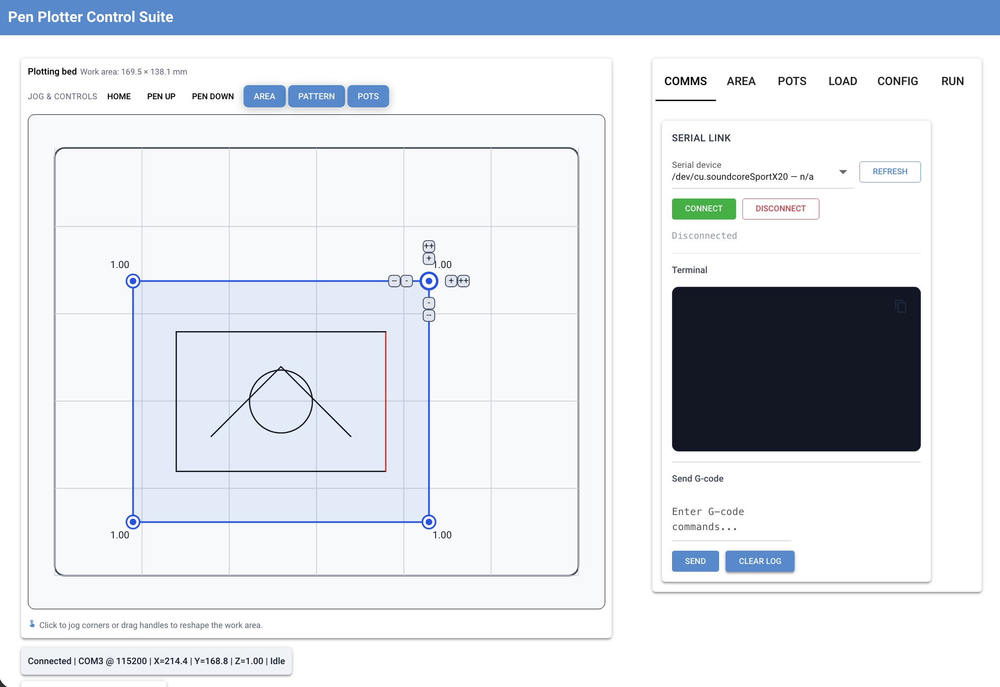

# Pen Plotter Control Suite

Modern tooling tuned for the [LY Drawbot](https://nl.aliexpress.com/item/32967477326.html?gatewayAdapt=glo2nld) AliExpress pen plotter, built around GRBL control, servo-based pen lift, and four-corner bed compensation.

> Replace `docs/images/ui.png` with an actual screenshot of the NiceGUI interface when you have one.



## Overview

The Drawbot ships with a lightweight frame, a hobby servo that raises/lowers the pen, and a working area that is rarely perfectly level. This project wraps those quirks with:

- `nicegui_app.py` – Browser UI for calibrating bed corners, tuning pen lift speed and settle times, and issuing GRBL commands on the fly.
- `pattern.py` / `penplot_helper.py` – Geometry primitives plus a renderer that streams optimized tool paths while honouring servo timing.
- `patterns/` – Generative notebooks and exported SVGs that double as a plotting portfolio.

Use the GUI to drive hardware, import SVG artwork, or call the backend directly when you script bespoke jobs.

## Quick Start

```bash
python -m venv .venv
source .venv/bin/activate  # Windows: .venv\Scripts\activate
pip install --upgrade pip
pip install -r requirements.txt
```

Notebook tooling (optional):

```bash
pip install -r requirements-notebooks.txt
```

Python 3.10+ is recommended. The app works without a connected plotter, so you can explore the UI before bringing hardware online.

## Run the GUI

```bash
python nicegui_app.py \
  --area-size 300x245
```

Open the printed `http://127.0.0.1:PORT` link in your browser.

**Typical workflow**
- Drop SVG files onto the `Load` tab to queue them for plotting — this is the default path for artwork generated by the notebooks.
- Alternatively, paste pattern text into the load field and set feed/pen overrides inline when iterating on custom geometry.
- Use the four corner inputs to level the not-so-flat drawbed; the app generates a bilinear compensation map so the pen keeps consistent pressure.
- Tune servo positions, lift speed, and wait times to match different pens or paper thicknesses.
- Explore the built-in terminal to jog the plotter, send raw G-code, and tweak GRBL configuration values without leaving the browser.

## Programmatic Use

The backend runs headless when you want to drive the LY Drawbot directly from Python:

```python
from pattern import Pattern, Circle, Renderer
from penplot_helper import GRBL, Config

pattern = Pattern().add(Circle((150.0, 120.0), r=80.0, pen_id=1))

grbl = GRBL(Config(port='/dev/tty.usbserial-A50285BI')).connect()
renderer = Renderer(grbl, optimize='nn')
renderer.run(pattern)
```

Apply helpers such as `Pattern.optimize_order_nn`, `resample_polylines`, and `combine_endpoints` to clean up geometry before execution.

## Patterns & Notebooks

Notebooks in `patterns/` explore double pendulums, ray tracing, handwriting synthesis, moiré fields, and more. Each notebook exports SVGs into its folder; load them into the GUI or stream them directly with the renderer.

## Troubleshooting

- macOS serial ports appear under `/dev/tty.usb*`; Linux typically uses `/dev/ttyUSB*`. Run `python -m serial.tools.list_ports` to discover devices.
- Re-run the four-corner calibration whenever the machine is moved—the compensation matrix relies on fresh measurements.
- The GUI sets `MPLCONFIGDIR` to `.matplotlib_cache/` to avoid permission issues; keep the directory writable.
- Always validate new tool paths with the pen lifted and keep the pause/cancel controls handy for untrusted SVGs.

## License

This project is licensed under the MIT License.  
See the [LICENSE](LICENSE) file for details.
